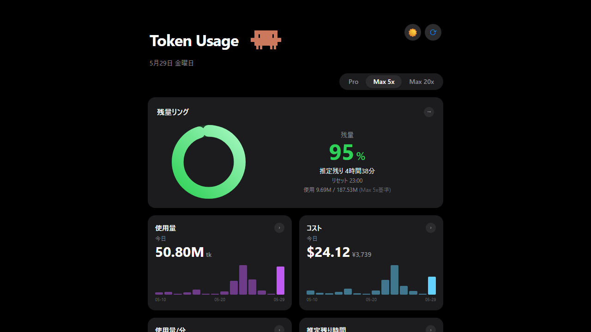
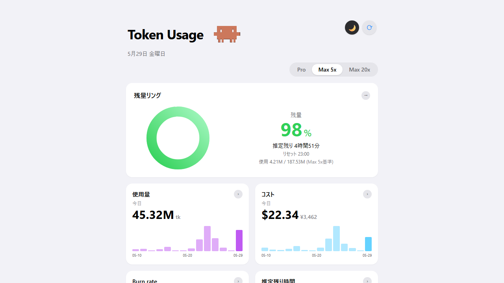

# Token Usage 🦀

Claude Code のトークン残量・コスト・使用状況をブラウザでリアルタイム監視するダッシュボード。


---

## スクリーンショット

| ダークモード | ライトモード |
|---|---|
|  |  |

---

## 機能

- 🟢 **残量リング** — 5時間ブロックの消費量を円形メーターで表示（緑→黄→赤）
- ⏱ **推定残り時間** — 現在のブロックがリセットされるまでの残り時間
- 📈 **使用量 / コスト** — 今日のトークン数・USD/JPY コスト（直近14日グラフ付き）
- ⚡ **使用量/分** — 現在の消費ペース（tokens/min）
- 📅 **過去1週間** — 日別トークン量の棒グラフ
- 🌙 **ダーク / ライト切替** — ☀️🌙ボタンで即時切替、設定を記憶
- 📱 **スマホ対応** — 同一 Wi-Fi で `http://[PCのIP]:3000` にアクセス可能
- 🔄 **30秒自動更新** + 手動更新ボタン
- 📊 **Pro / Max 5x / Max 20x** プラン切替（過去実績ベースで上限を自動推定）

---

## 必要な環境

- **Windows**（Mac / Linux 非対応）
- **Claude Code を使っていること**（データソースとして使用）
- **Node.js 18 以上**（↓ 入っていない場合は先にインストール）

### Node.js のインストール

1. https://nodejs.org/ を開く
2. **LTS 版**（推奨版）をダウンロード
3. インストーラーを実行（すべてデフォルトで OK）
4. インストール後、ターミナルで確認：
   ```
   node -v
   ```
   `v18.x.x` 以上が表示されれば OK

---

## インストールと起動

### 方法① ZIP でダウンロード（git 不要・簡単）

1. このページ上部の **「Code」→「Download ZIP」** をクリック
2. ZIP を解凍してフォルダを好きな場所に置く
3. フォルダ内の **`起動する.bat` をダブルクリック**

### 方法② git clone（git が使える方）

```bash
git clone https://github.com/zeroichi-code/cc-checker.git
cd cc-checker
```

あとは **`起動する.bat` をダブルクリック**。

---

### 初回起動について

- 初回のみ依存パッケージのインストールが自動で走ります（1〜2分）
- ブラウザが自動で `http://localhost:3000` を開きます
- **初回は「データなし」で表示されることがあります** → 画面右上の 🔄 ボタンを押してください
- 2回目以降は数秒で起動します

---

## トラブルシューティング

**データが表示されない**
→ Claude Code を一度起動して会話してからリロードしてください。`~/.claude/` 配下にログが生成されていないと表示されません。

**ブラウザが自動で開かない**
→ 手動で `http://localhost:3000` にアクセスしてください。

**ポート 3000 が使用中というエラーが出る**
→ 他のアプリがポート 3000 を使っています。一度 PC を再起動してから `起動する.bat` を実行してください。

**「npx ccusage のダウンロードに時間がかかります」と表示される**
→ 初回のみ ccusage のダウンロードが発生します。そのままお待ちください（30秒〜数分）。

---

## データソース

[ccusage](https://github.com/ryoppippi/ccusage) CLI が `~/.claude/projects/` 配下の JSONL を解析します。  
**特別な設定・API キーは不要です。** Claude Code を使っていれば自動でデータが表示されます。

---

## 技術スタック

| | |
|---|---|
| フレームワーク | Next.js 14 (App Router) + TypeScript |
| スタイリング | Tailwind CSS |
| データ取得 | SWR（30秒自動更新） |
| データソース | ccusage CLI（`npx ccusage@latest`） |

---

## ライセンス

MIT
